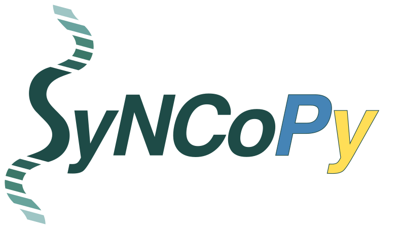

.. _analysistools-syncopy:

SyNCoPy
-------

.. short_description_start

:ref:`analysistools-syncopy` is a Python library providing high level functions for electrophysiological time series
and spike data analysis. It allows to conveniently perform complex analysis workflows including data preprocessing,
time-frequency and connectivity analysis. SyNCoPy is specifically tailored for very large ("bigger than memory") datasets,
leveraging parallelized computation on many different platforms. It is designed after the well established FieldTrip
MatLab package and supports MNE Python, NWB and FieldTrip data formats.

.. image:: https://img.shields.io/github/stars/esi-neuroscience/syncopy?style=social
    :alt: GitHub Repo stars for SyNCoPy
    :target: https://github.com/esi-neuroscience/syncopy

.. short_description_end

SyNCoPy (Systems Neuroscience Computing in Python, spelled Syncopy in the following) is a Python toolkit for user-friendly, large-scale electrophysiology data analysis. It strives to achieve the following goals:

Syncopy provides a full open source Python environment for reproducible electrophysiology data analysis.

Syncopy is scalable to accommodate very large datasets. It automatically makes use of available computing resources and is developed with built-in parallelism in mind.

Syncopy is compatible with the MATLAB toolbox `FieldTrip <https://www.fieldtriptoolbox.org/>`_.

Syncopy supports reading data from NWB and exporting data to NWB. See `Syncopy Data Basics <https://syncopy.readthedocs.io/en/latest/user/data_basics.html>`_ for more information.

